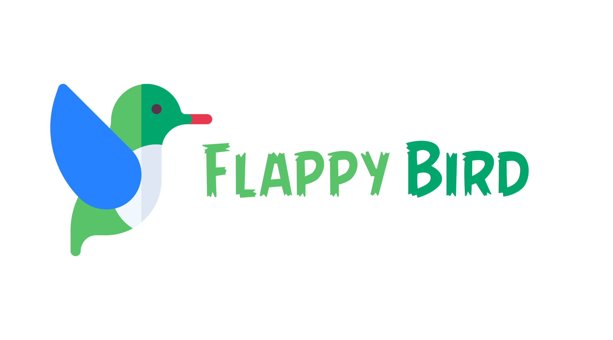
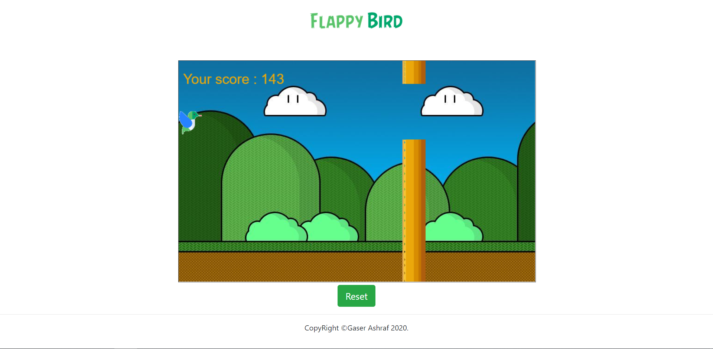

# Flappy-Bird
Flappy Bird is a game where a side-scroller where the player controls a bird, attempting to fly between columns of yellow pipes without hitting them.
## Build with
* HTML5 * canvas
## 📷Screen Shots

